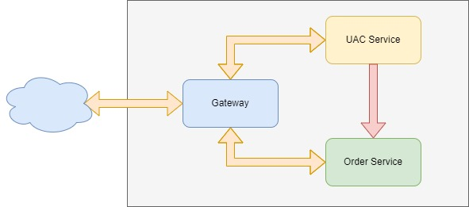
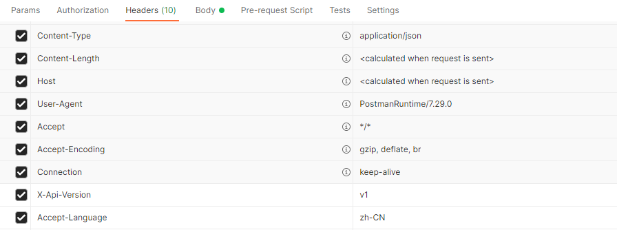
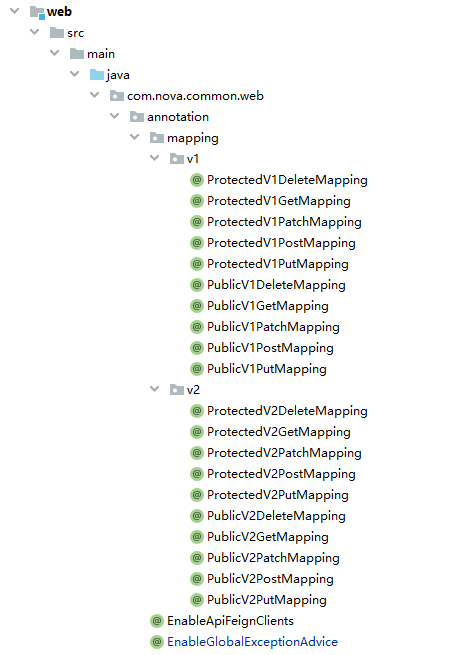

# SNOWBALL

SpringCloud Quick Start Template

## 功能
* DOCKER开发和部署
* 数据库服务
* NACOS服务
* 接口设计
* 国际化处理
* 分布式事务Seata
* Sentinel
* [TODO]登录认证和权限控制
* [TODO]Jenkins
* [TODO]Log管理, ELK
* [TODO]链路追踪，Zipkin

## 运行
```shell script
mvn clean install
# add --build to rebuild images
docker-compose up --build
```

## SNOWBALL说明

新增模块建议在snowball/pom.xml中添加dependencyManagement，以减少导入时version的书写
```pom
    <dependencyManagement>
        <dependencies>
            ...
            <!--snowball artifacts version management-->
            <dependency>
                <groupId>com.nova</groupId>
                <artifactId>core</artifactId>
                <version>${project.version}</version>
            </dependency>
            <dependency>
                <groupId>com.nova</groupId>
                <artifactId>web</artifactId>
                <version>${project.version}</version>
            </dependency>
            <dependency>
                <groupId>com.nova</groupId>
                <artifactId>seata</artifactId>
                <version>${project.version}</version>
            </dependency>
            <dependency>
                <groupId>com.nova</groupId>
                <artifactId>gateway</artifactId>
                <version>${project.version}</version>
            </dependency>
            <dependency>
                <groupId>com.nova</groupId>
                <artifactId>uac-api</artifactId>
                <version>${project.version}</version>
            </dependency>
            <dependency>
                <groupId>com.nova</groupId>
                <artifactId>auth-api</artifactId>
                <version>${project.version}</version>
            </dependency>
            <dependency>
                <groupId>com.nova</groupId>
                <artifactId>order-api</artifactId>
                <version>${project.version}</version>
            </dependency>
        </dependencies>
    </dependencyManagement>
```

### DOCKER开发和部署

参考官方文档，安装docker环境

[Docker官网](https://www.docker.com/)

Gateway服务Dockerfile示例，新建服务只需要拷贝startup.sh、wait-for.sh、Dockerfile，并改Dockerfile中的`JAR_NAME`
```dockerfile
FROM openjdk:8u212-jre-alpine

ENV JAR_NAME=gateway TZ=Asia/Shanghai JAVA_OPTS="-Xms200m -Xmx200m"

ADD ./startup.sh ./startup.sh
ADD ./wait-for.sh ./wait-for.sh
RUN chmod +x ./startup.sh ./wait-for.sh

ADD ./target/${JAR_NAME}.jar /app/

ENTRYPOINT ["/usr/bin/env"]
CMD ["./startup.sh"]

EXPOSE 6001
```

Dockerfile中shell脚本说明：
* `startup.sh`：用于启动java服务或者原来镜像的ENTRYPOINT服务
* `wait-for.sh`：用于等待某个服务和端口启动后再进行启动，参考Gateway服务的`command: `
```yaml
  gateway:
    hostname: gateway
    image: snowball/gateway:${SNOWBALL_VERSION}
    build:
      context: ./gateway
    depends_on:
      - nacos-server
    command: ./wait-for.sh -t 0 nacos-server:8848 -- ./startup.sh
    restart: always
    ports:
      - 8080:8080
```

### 数据库服务

位于`server/database`

目录说明：
* tmp: 临时目录，目前docker-compose.yml中配置的数据和日志映射到tmp目录下，**生产环境请注意切换合适的存储位置**
* conf.d: MySQL配置目录，具体配置请查看`mysql.cnf`
* initdb.d: 数据库初始化SQL脚本目录，目前有nacos、seata、order、uac三个服务的SQL

### NACOS服务（注册中心、配置中心）

位于`server/nacos`

目录说明：
* tmp: 临时目录，目前docker-compose.yml中配置的日志映射到tmp目录下，**生产环境请注意切换合适的存储位置**
* resources: 存放各个Group的配置文件，**注意**：此处只是保存配置，并未配置到Nacos中，如需导入，可以将resources/*打包成zip，然后启动Nacos服务导入进去

### 接口设计

* 接口建议采用RESTful规范进行设计

    * [RESTful API 设计指南](http://www.ruanyifeng.com/blog/2014/05/restful_api.html)
    * [RESTful API设计中常见的问题和解决方案](https://www.jianshu.com/p/4d4b4d9074ac)
    * [Getting started with the REST API](https://docs.github.com/cn/rest/guides/getting-started-with-the-rest-api)

* 接口必须通过HTTP STATUS进行响应，这样SpringCloud才能进行异常的捕获和传递，方便后续分布式事务的处理
例如，创建订单时，检测到用户不存在，应该直接`throw new ApiBusinessException(ApiCode.USER_NOT_EXIST, order.getUserId());`

**接口设计**

* 成功的接口响应，HTTP Response Body总是返回用户需要的信息，不再包装code、message等其他字段

例如，获取订单信息的接口，`http://localhost:8080/order/orders/1`
```json
{
  "id": 1,
  "userId": 1,
  "name": "订单1",
  "status": 0,
  "createTime": "2020-02-02T00:00:00.000+00:00"
}
```

复杂的返回数据，建议也要采用合理的组织结构，不要将不同的复杂对象的字段放到一个层级，例如，用户详细信息接口
```json
{
    "id": 1,
    "username": "snowball",
    "name": "雪球",
    "department": {
      "id": 1,
      "name": "研发部"
    }
}
```

* 失败的接口响应(HTTP STATUS 4xx/5xx)，在SpringCloud的异常信息基础上，补充`apiCode`和`apiMessage`字段

```json
{
    "timestamp": "2022-05-12T07:20:22.174+00:00",
    "status": 500,
    "error": "Internal Server Error",
    "exception": "feign.FeignException$InternalServerError",
    "message": "[500] during [GET] to [http://uac-service/uac/users/hello/exception] [UserClient#getUserThrowException()]: [{\"timestamp\":\"2022-05-12T07:20:22.058+00:00\",\"status\":500,\"error\":\"Internal Server Error\",\"exception\":\"java.lang.RuntimeException\",\"message\":\"user not exists\",\"path\":\"/uac/users/hello/exception\",\"apiCode\":1,\"apiMessage\":\"fail\"}]",
    "path": "/order/orders/hello/global/transaction",
    "apiCode": 1,
    "apiMessage": "失败"
}
```


#### 接口访问限制、版本控制、国际化信息处理



**外部（Gateway）访问和微服务内部（FeignClient）访问的区分**

微服务整体，通过Gateway将接口API提供给用户访问，微服务内部之间通过FeignClient进行调用，例如UAC-用户和订单服务，订单服务需要访问用户信息。有些接口可能涉及敏感或者重要的数据，并不能暴露出来进行访问。

内外网访问限制实现，设计`X-Origin` HTTP Header: <br/>
1. 当接口从Gateway进行访问时，会通过Filter，设置`X-Origin=Gateway`
2. 当接口从FeignClient进行访问时，会设置`X-Origin=Feign`

**接口版本区分**

接口版本控制实现，设计`X-Api-Version` HTTP Header: <br/>
APP或者WEB调用接口时，需要设置`X-Api-Version=v1`来控制接口版本


**接口错误信息，国际化处理**

common/web中`CustomErrorAttributes`类会统一拦截错误，补充`apiCode`和`apiMessage`字段，其中`apiMessage`字段会根据当前请求的HTTP Header `Accept-Language`自动匹配Locale，返回对应的错误提示。

i18n文件存放在common/web的resources/i18n目录下，包括`ApiCode`和`messages`两个bundle

**Annotation注解，方便进行访问限制和版本控制**

设计`Annotation`相关类:
* PublicXXXMapping标记为公共接口（允许从Gateway和FeignClient访问），ProtectedXXXMapping标记为保护接口（只允许从FeignClient访问）
* XXXV1XXXMapping=接口版本v1，XXXV2XXXMapping=接口版本v2




### 国际化处理

common/web中`I18nUtils`类，封装了MessageSource的方法，导入到Java文件进行调用即可。

* resources/i18n/ApiCode：专门存放ApiCode对应的国际化解析信息
* resources/i18n/messages：存放其他消息对应的国际化解析信息

### 分布式事务Seata

[Seata](http://seata.io/zh-cn/docs/overview/what-is-seata.html) - Seata官方文档

分布式事务涉及的database中都需要添加seata要求的`undo_log`表，参考server/database/initdb.d/snowball_uac.sql和server/database/initdb.d/snowball_order.sql

```sql
-- ----------------------------
-- SEATA Global Transaction
-- Table structure for undo_log
-- 注意此处0.3.0+ 增加唯一索引 ux_undo_log
-- ----------------------------
CREATE TABLE IF NOT EXISTS `undo_log` (
  `id` bigint(20) NOT NULL AUTO_INCREMENT,
  `branch_id` bigint(20) NOT NULL,
  `xid` varchar(100) NOT NULL,
  `context` varchar(128) NOT NULL,
  `rollback_info` longblob NOT NULL,
  `log_status` int(11) NOT NULL,
  `log_created` datetime NOT NULL,
  `log_modified` datetime NOT NULL,
  `ext` varchar(100) DEFAULT NULL,
  PRIMARY KEY (`id`),
  UNIQUE KEY `ux_undo_log` (`xid`,`branch_id`)
) ENGINE=InnoDB AUTO_INCREMENT=1 DEFAULT CHARSET=utf8;
```

使用说明：
1. 在对应service pom中导入依赖
```pom
<dependency>
    <groupId>com.nova</groupId>
    <artifactId>seata</artifactId>
</dependency>
```
2. 在需要分布式事务的方法上添加`@GlobalTransactional`注解
```java
@GlobalTransactional(rollbackFor = Exception.class)
@Override
public void testGlobalTransaction(Order order) {
  // do something
}
```

### Sentinel

[Sentinel:分布式系统的流量防卫兵](https://github.com/alibaba/Sentinel/wiki/%E4%BB%8B%E7%BB%8D)

Gateway网关集成了Sentinel流量控制，DataSource采用nacos。
```yaml
spring:
  cloud:
    sentinel:
      log:
        dir: ./logs/csp
      datasource:
        flow:
          nacos:
            server-addr: nacos-server:8848
            dataId: ${spring.application.name}-sentinel-rules
            groupId: SENTINEL_GROUP
            data-type: json
            rule-type: flow
```

Sentinel控制配置文件/server/nacos/resources/DEFAULT_GROUP/gateway-sentinel-rules
```json
[
  {
    "resource": "uac-service",
    "count": 100,
    "grade": 1,
    "limitApp": "default",
    "strategy": 0,
    "controlBehavior": 0
  },
  {
    "resource": "order-service",
    "count": 100,
    "grade": 1,
    "limitApp": "default",
    "strategy": 0,
    "controlBehavior": 0
  }
]
```

## 参考
* [Piggy Metrics](https://github.com/sqshq/piggymetrics) - Piggy Metrics Github
* [Pig](https://github.com/pig-mesh/pig) - Pig Github
* [Seata](https://github.com/seata/seata) - Seata Github
* [Nacos Docker](https://github.com/nacos-group/nacos-docker) - Nacos Docker Github
